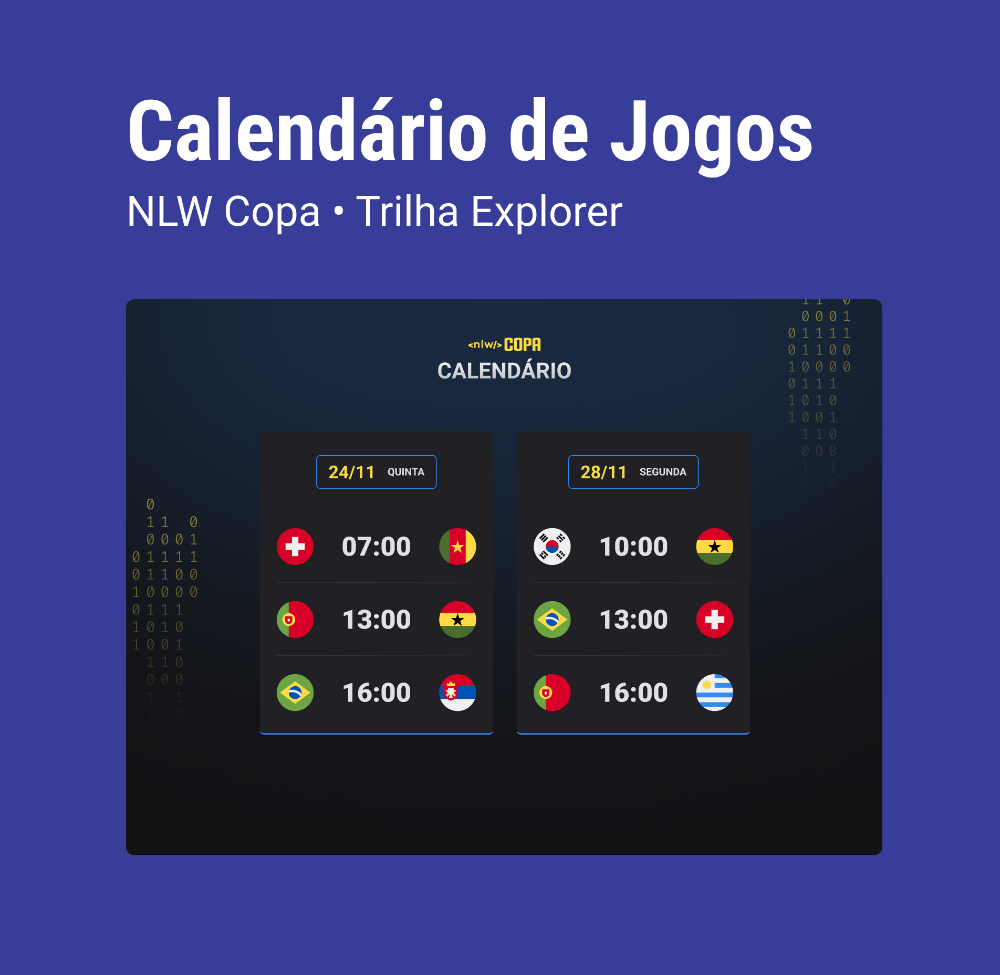

<h1 align="center">NLW #10 Copa by Rocketseat </h1>
 

Evento exclusivo e gratuito, promovido pela Rocketseat para ensino de tecnologias WEB

 

  

 

---

 

## Tecnologias

- HTML e CSS
- JavaScript
- Git e Github

## Projeto

O calendário da copa mostra os jogo da Copa Catar 2022.

## Layout

Você pode visualizar o layout do projeto através [DESSE LINK](<https://www.figma.com/file/KbXCIhAjZxa1ni2QOO5lE3/Calend%C3%A1rio-de-Jogos-(Community)?node-id=0%3A1>). É necessário ter conta no [Figma](https://www.figma.com) para acessá-lo

## Licença

Esse projeto está sob a licença MIT.
